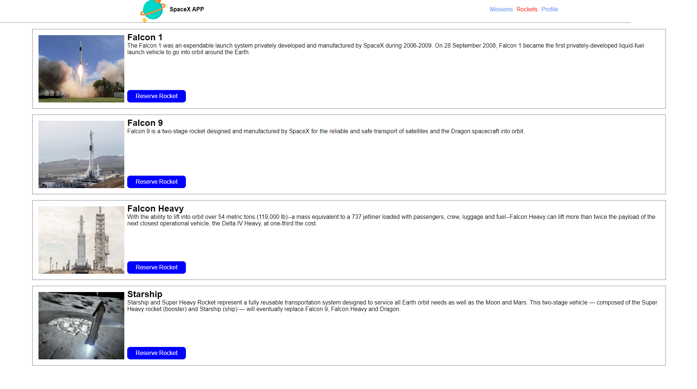

<!-- PROJECT LOGO -->
<br />
<p align="center">
  <a href="https://github.com/David-Verde/Bookstore">
    
  </a>

  <h3 align="center">ReactJs --> [Space Hub]</h3>

  <p align="center">
    This project is part of the Microverse curriculum in React module!
    <br />
    <a href="https://github.com/David-Verde/Bookstore"><strong>Explore the docs »</strong></a>
    <br />
    <br />
    <a href="https://github.com/David-Verde/Bookstore/issues">Report Bug</a>
    ·
    <a href="https://github.com/David-Verde/Bookstore/issues">Request Feature</a>
  </p>
</p>

<!-- TABLE OF CONTENTS -->
## Table of Contents

* [About the Project](#about-the-project)
  * [Built With](#built-with)
  * [Usage](#usage)
  * [Automated Test](#automated-test)
* [Contributors](#contributors)
* [Acknowledgements](#acknowledgements)
* [License](#license)

<!-- ABOUT THE PROJECT -->
## About The Project
In this project we created a space x web page to reserve missions and rockets from the space x API
###
  

### Built With
This project was built using these technologies.
* HTML/CSS
* ReactJs
* Redux
* npm
* ES6
* Node.js
* ESLint
* StyleLint
* jest
* Thunks


<!-- INSTALLATION -->
## Usage

To have this app on your pc, you need to:

  - Clone with SSH:
  ```
 git@github.com:David-Verde/Bookstore.git
  ```
  - Clone with HTTPS
  ```
 https://github.com/David-Verde/Bookstore.git
  ```

* In the project directory, you can run:

  - `$ npm install` - installs all the dependencies required by the project

  - `$ npm start` - runs the app in the development mode:
    - Open [http://localhost:3000](http://localhost:3000) to view it in the browser.
    - The page will reload if you make edits.
    - You will also see any lint errors in the console.

  - `$ npm run build`
    - Builds the app for production to the `build` folder.
    - It correctly bundles React in production mode and optimizes the build for the best performance.
    - The build is minified and the filenames include the hashes.
    - Your app is ready to be deployed!

## netlify live version
 > https://62d9bc18ce037a18b651fb18--wonderful-vacherin-bfde52.netlify.app/Profile


## Show your support

Give a :star: if you like this project!

<!-- ACKNOWLEDGEMENTS -->
## Acknowledgements
* [Microverse](https://www.microverse.org/)
* [The Odin Project](https://www.theodinproject.com/)
* [React Documentation](https://reactjs.org/docs/getting-started.html)
* [Heroku Documentation](https://devcenter.heroku.com/)
* [Heroku Buildpack](https://github.com/mars/create-react-app-buildpack#user-content-requires)


Authors
👤 **David Verde Alvarez**
- This is My **GitHub**: [](https://github.com/David-Verde)
- This is My **Twitter**: [](https://twitter.com/UnyieldingOne)
)

👤 **Andrés Garzon**

- This is My **GitHub**: [](https://github.com/andgarzonmal)
- This is My **LinkedIn**: [](https://www.linkedin.com/in/andres-garzon-maldonado-951a2a180/)
)

## 📝 License

This project is [MIT](https://github.com/David-Verde/Bookstore/blob/dev/LICENSE) licensed.


